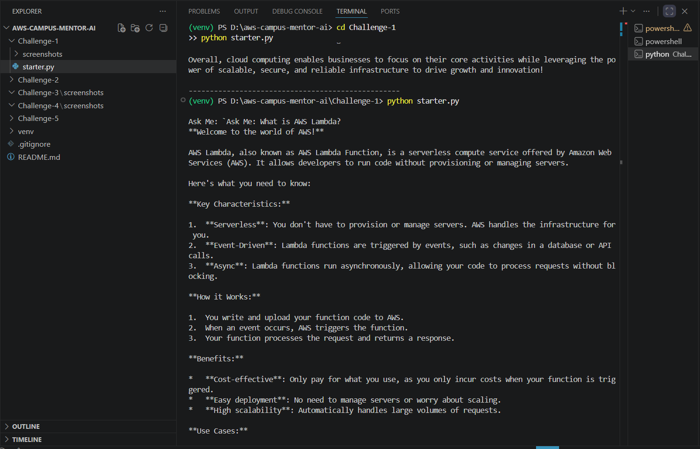
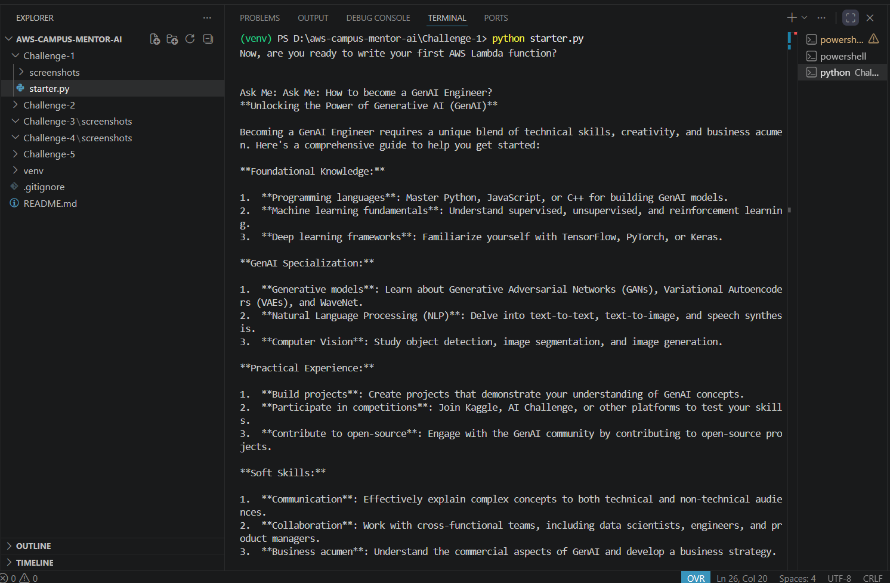

# 🚀 Challenge 1 – AWS Campus Mentor AI

## Building an AWS Learning Assistant using Strands SDK and Ollama

### 📌 Overview

As part of the AWS User Group Madurai Builders Skill Sprint Challenge, I built **AWS Campus Mentor AI**, a locally running AI assistant designed to help students learn AWS Cloud, Generative AI, and modern cloud technologies.

Unlike traditional chatbots, this project runs completely on a local machine using **Ollama** and **Llama 3.2 (3B)** without requiring cloud APIs or paid AI services.

The objective of this challenge was to understand the fundamentals of AI Agents using the **Strands Agents SDK** and explore how Large Language Models can be integrated into real-world learning assistants.

---

## 🎯 Challenge Objective

Build a simple AI Agent using:

* Strands Agents SDK
* Ollama
* Llama 3.2 : 3B Model

The agent should:

* Run locally
* Accept user questions
* Generate intelligent responses
* Demonstrate basic AI Agent architecture

---

## 💡 My Approach

Instead of creating a generic chatbot, I designed an AI assistant specifically for students interested in:

* AWS Cloud Computing
* Amazon Bedrock
* Generative AI
* Career Guidance
* Cloud Engineering

The assistant acts like a personal AWS mentor and helps beginners understand cloud concepts in simple language.

---

## 🏗️ Architecture

```text
User Question
      │
      ▼
AWS Campus Mentor AI
      │
      ▼
Strands SDK Agent
      │
      ▼
Ollama Model
(llama3.2:3b)
      │
      ▼
Generated Response
```

---

## 🛠️ Technologies Used

| Technology     | Purpose                 |
| -------------- | ----------------------- |
| Python         | Application Development |
| Strands SDK    | Agent Framework         |
| Ollama         | Local Model Runtime     |
| Llama 3.2 : 3B | Language Model          |
| VS Code        | Development Environment |

---

## 📂 Project Structure

```text
Challenge-1/
│
├── starter.py
├── README.md
└── screenshots/
    ├── SS1.png
    └── SS2.png
```

---

## ⚙️ Setup Instructions

### Create Virtual Environment

```bash
python -m venv venv
```

### Activate Environment

```bash
venv\Scripts\activate
```

### Install Dependencies

```bash
pip install strands-agents
pip install "strands-agents[ollama]"
```

### Pull the Model

```bash
ollama pull llama3.2:3b
```

### Run Ollama

```bash
ollama serve
```

### Run the Agent

```bash
python starter.py
```

---

## 🧪 Example Questions

### AWS Fundamentals

```text
What is AWS Lambda?
```

### Cloud Computing

```text
Why is cloud computing important?
```

### Generative AI

```text
How does Amazon Bedrock work?
```

### Career Guidance

```text
How can I become a GenAI Engineer?
```

---

## 📸 Results

The AI assistant successfully answered AWS, Cloud, and Generative AI related questions using a fully local LLM.

Key achievements:

✅ Local AI inference using Ollama

✅ Interactive chatbot experience

✅ AWS-focused learning assistant

✅ No cloud API costs

✅ Beginner-friendly architecture

### AWS Lambda Question



### GenAI Engineer Question



---

## 🎓 Learning Outcomes

Through this challenge, I learned:

* Fundamentals of AI Agents
* Local LLM deployment using Ollama
* Agent orchestration using Strands SDK
* Prompt engineering basics
* Building educational AI assistants
* End-to-end AI application development

---

## 🚀 Future Improvements

Planned enhancements include:

* Amazon Bedrock Integration
* Tool Calling
* Persistent Memory
* MCP Integration
* AWS Documentation Search
* Multi-Agent Architecture

These enhancements will be implemented in upcoming challenges.

---

## 🏆 Conclusion

This challenge provided a strong foundation for understanding how AI Agents work. By combining Strands SDK with Ollama, I was able to build an AWS-focused educational assistant that runs entirely on a local machine.

This project serves as the first step toward building more advanced AI systems using Amazon Bedrock, Memory, Tool Calling, and MCP in subsequent challenges.
