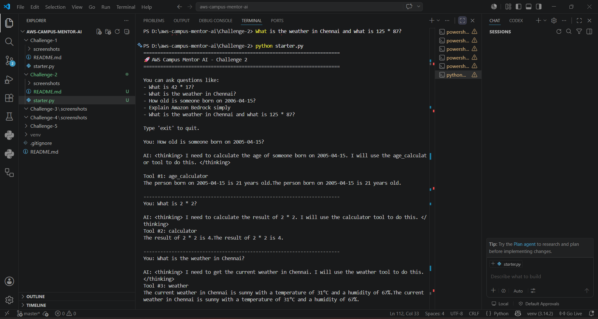
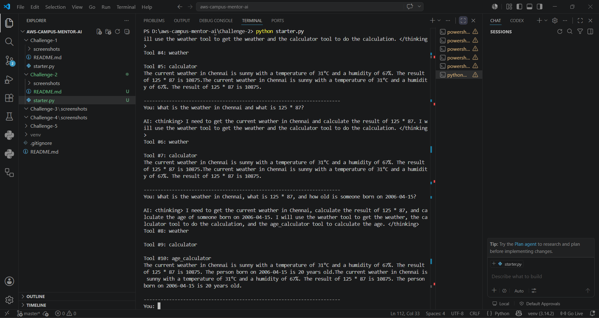
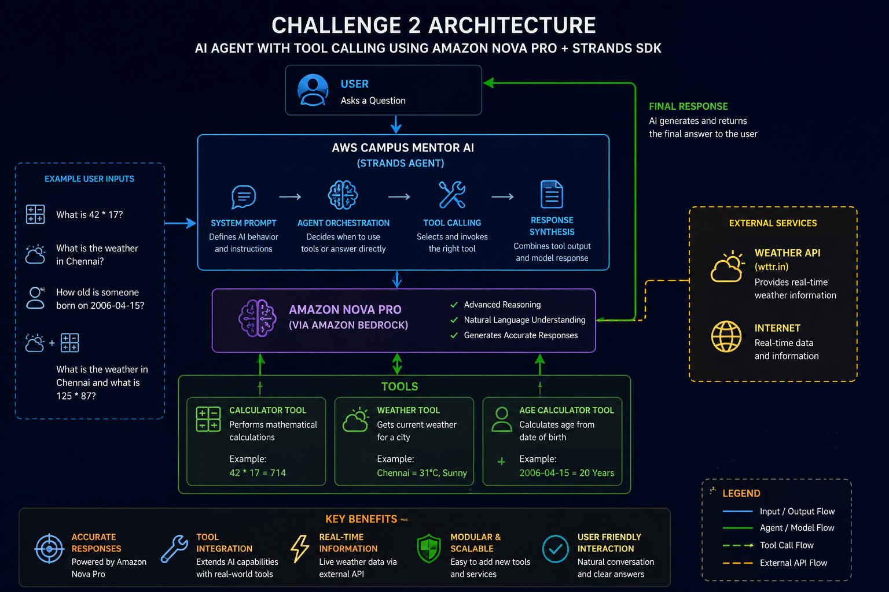

# 🚀 Challenge 2 – AWS Campus Mentor AI with Tool Calling

## 📖 Overview

This project demonstrates an AI-powered assistant built using **Amazon Nova Pro**, **Amazon Bedrock**, and the **Strands Agents SDK**.

Unlike Challenge 1, where the AI only generated responses using its language model, this challenge introduces **Tool Calling**, allowing the AI to interact with external tools and provide more accurate, dynamic, and real-time answers.

The AI agent can:

* Perform mathematical calculations
* Fetch live weather information
* Calculate age from a date of birth
* Answer AWS and Generative AI questions
* Automatically choose the correct tool based on user intent

This project showcases how modern AI agents can extend beyond simple conversations and interact with external capabilities.

---

# 🎯 Challenge Objective

Build an AI Agent that can:

1. Understand user questions
2. Identify when a tool is needed
3. Invoke the correct tool automatically
4. Process tool output
5. Generate a natural language response

---

# 🏗️ Architecture

```text
                    User
                      │
                      ▼
          AWS Campus Mentor AI
              (Strands Agent)
                      │
                      ▼
        Amazon Nova Pro (Bedrock)
                      │
     ┌─────────┬─────────┬─────────┐
     ▼         ▼         ▼
Calculator   Weather   Age Tool
   Tool        Tool
              Tool
     └─────────┴─────────┘
               │
               ▼
        Intelligent Response
               │
               ▼
              User
```

---

## 🛠️ Technologies Used

* Python
* Amazon Bedrock
* Amazon Nova Pro
* Strands Agents SDK
* Requests Library
* Tool Calling Architecture

---

# ⚡ Features

### 🧮 Calculator Tool

Performs mathematical calculations.

Example:

```text
What is 42 * 17?
```

Output:

```text
714
```

---

### 🌤️ Weather Tool

Fetches real-time weather information.

Example:

```text
What is the weather in Chennai?
```

Output:

```text
Temperature, Humidity, Weather Condition
```

---

### 🎂 Age Calculator Tool

Calculates age from date of birth.

Example:

```text
How old is someone born on 2006-04-15?
```

Output:

```text
20 Years Old
```

---

### 🤖 AWS Knowledge Assistant

Provides explanations for AWS and Generative AI topics.

Example:

```text
Explain Amazon Bedrock simply
```

---

# 📁 Project Structure

```text
Challenge-2/
│
├── starter.py
├── README.md
│
└── screenshots/
    ├── SS1.png
    ├── SS2.png
    └── Challenge-2-Architecture.png
```

---

# 🚀 Setup Instructions

## Step 1 – Activate Virtual Environment

```bash
venv\Scripts\activate
```

---

## Step 2 – Install Dependencies

```bash
pip install strands-agents
pip install strands-agents-tools
pip install requests
```

---

## Step 3 – Configure AWS Credentials

```bash
aws configure
```

Provide:

```text
AWS Access Key
AWS Secret Key
Region: us-east-1
Output: json
```

---

## Step 4 – Run the Project

```bash
python starter.py
```

---

# 💬 Sample Questions

```text
What is 42 * 17?
```

```text
What is the weather in Chennai?
```

```text
How old is someone born on 2006-04-15?
```

```text
Explain Amazon Bedrock simply.
```

```text
What is the weather in Chennai and what is 125 * 87?
```

```text
What is the weather in Chennai, what is 125 * 87, and how old is someone born on 2006-04-15?
```

---

# 📸 Screenshots

## Tool Calling Demonstration



---

## Multi-Tool Execution



---

## Architecture Diagram



---

# 🎓 Learning Outcomes

Through this challenge, I learned:

* Amazon Bedrock integration
* Amazon Nova Pro usage
* AI Tool Calling architecture
* Building custom AI tools
* Strands Agents SDK workflow
* Multi-tool orchestration
* Real-time AI interactions
* Designing intelligent AI assistants

---

# 🏆 Challenge Outcome

Successfully built an AI Agent capable of:

✅ Mathematical reasoning

✅ Real-time weather retrieval

✅ Age calculation

✅ AWS knowledge assistance

✅ Automatic tool selection

✅ Multi-tool execution

This challenge represents the transition from a simple AI assistant to a real-world AI Agent capable of interacting with external tools and services.

---

# 🚀 Next Challenge

Challenge 3 introduces:

🧠 Persistent Memory

🗂️ FAISS Vector Storage

💾 User Preference Storage

🔄 Memory Recall Capabilities

allowing the AI agent to remember and personalize future conversations.
