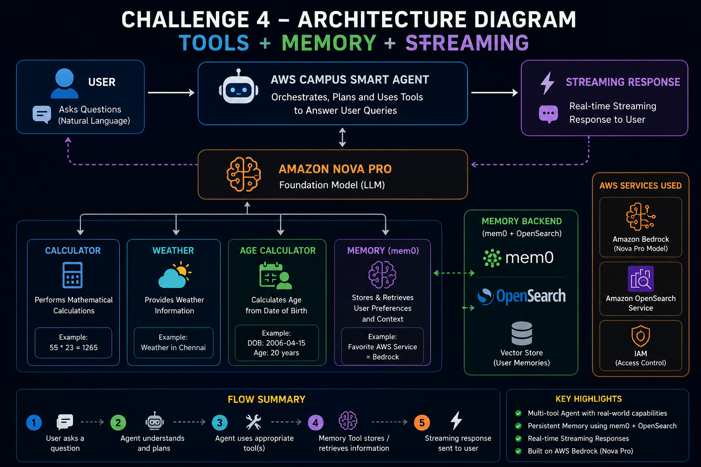
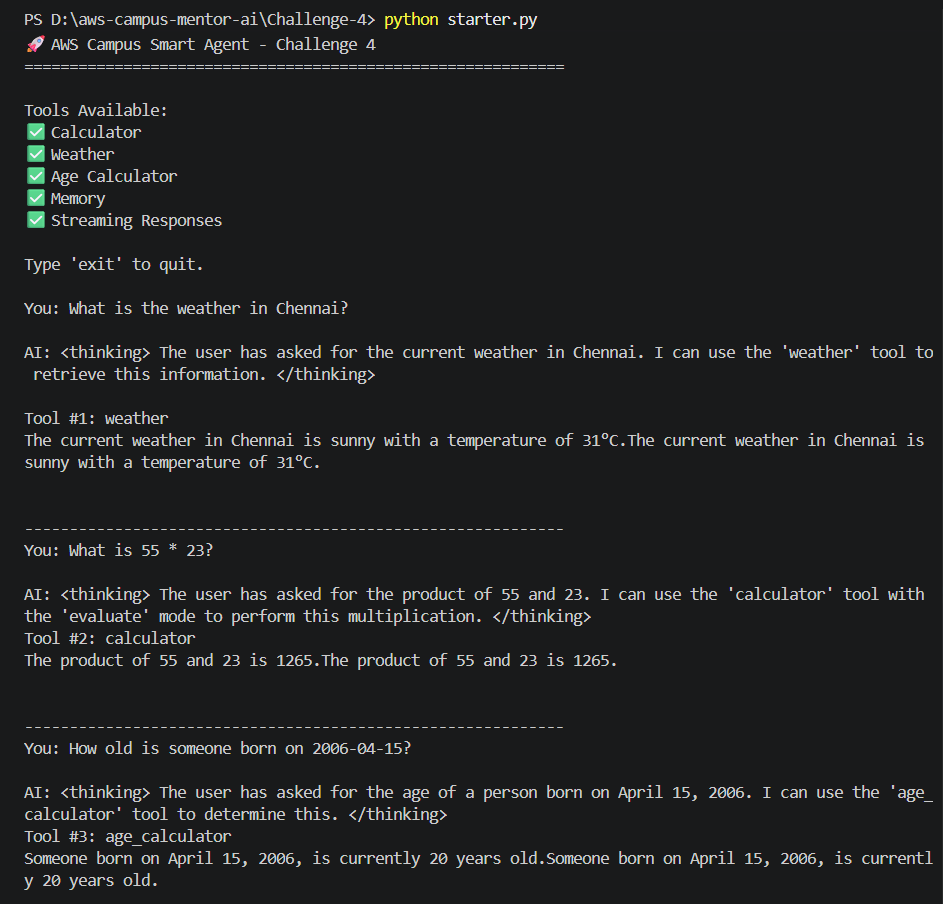
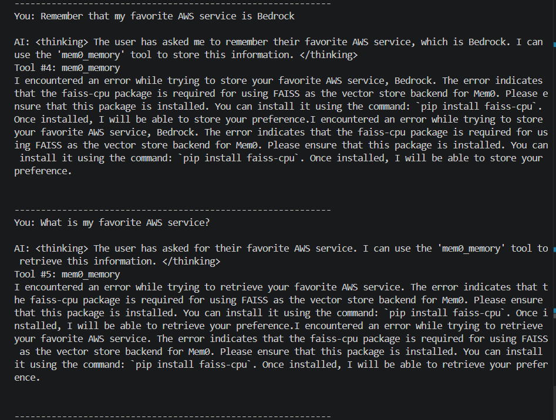

# 🚀 Challenge 4 – AWS Campus Smart Agent

## 📌 Overview

Challenge 4 focuses on building a complete AI Agent using the Strands SDK with Amazon Bedrock (Nova Pro), integrating multiple tools, memory capabilities, and real-time streaming responses.

This project demonstrates how modern AI Agents can intelligently choose and use tools, process user requests, remember information, and generate responses in real time.

---

## 🎯 Challenge Objective

Build a fully functional AI Agent that can:

✅ Answer general questions

✅ Perform mathematical calculations

✅ Fetch weather information

✅ Calculate age from date of birth

✅ Store and retrieve user preferences

✅ Stream responses in real-time

---

# 🏗️ Architecture



---

# ⚙️ Technologies Used

| Technology | Purpose |
|------------|----------|
| Strands SDK | AI Agent Framework |
| Amazon Bedrock | Foundation Model Access |
| Amazon Nova Pro | Large Language Model |
| Python | Application Development |
| mem0 | Memory Management |
| OpenSearch | Vector Storage |
| FAISS | Local Vector Search |
| Streaming API | Real-Time Responses |

---

# 🤖 AI Agent Workflow

```text
User Query
     ↓
AWS Campus Smart Agent
     ↓
Amazon Nova Pro
     ↓
Tool Selection
 ├── Calculator
 ├── Weather
 ├── Age Calculator
 └── Memory
     ↓
Streaming Response
     ↓
User
```

---

# 🧰 Available Tools

## 🧮 Calculator Tool

Performs mathematical calculations.

### Example

Input:

```text
What is 55 * 23?
```

Output:

```text
1265
```

---

## 🌤️ Weather Tool

Provides weather information.

### Example

Input:

```text
What is the weather in Chennai?
```

Output:

```text
Sunny, 31°C
```

---

## 🎂 Age Calculator Tool

Calculates age from date of birth.

### Example

Input:

```text
How old is someone born on 2006-04-15?
```

Output:

```text
20 Years
```

---

## 🧠 Memory Tool

Stores and retrieves user preferences and personal information.

### Example

Input:

```text
Remember that my favorite AWS service is Bedrock
```

Stored as memory for future retrieval.

---

# 📂 Project Structure

```text
Challenge-4
│
├── starter.py
├── README.md
│
└── screenshots
    ├── SS1.png
    ├── SS2.png
    └── Challenge-4-Architecture.png
```

---

# 🚀 Installation

## Clone Repository

```bash
git clone https://github.com/your-username/aws-campus-mentor-ai.git
```

---

## Create Virtual Environment

```bash
python -m venv venv
```

---

## Activate Environment

Windows:

```bash
venv\Scripts\activate
```

---

## Install Dependencies

```bash
pip install strands-agents
pip install strands-agents-tools
pip install boto3
pip install mem0ai
pip install faiss-cpu
pip install opensearch-py
```

---

# ▶️ Run Project

```bash
python starter.py
```

---

# 🖥️ Sample Execution

```text
You: What is the weather in Chennai?

AI:
The current weather in Chennai is sunny with a temperature of 31°C.
```

---

```text
You: What is 55 * 23?

AI:
1265
```

---

```text
You: How old is someone born on 2006-04-15?

AI:
20 years old
```

---

# 📸 Screenshots

## Tool Usage



---

## Memory and Streaming



---

# 🎓 Learning Outcomes

Through this challenge, I learned:

- Building Tool-Enabled AI Agents
- Multi-Tool Agent Architecture
- Amazon Bedrock Integration
- Amazon Nova Pro Usage
- Real-Time Streaming Responses
- Memory-Based AI Systems
- OpenSearch and FAISS Integration
- Agent Orchestration using Strands SDK

---

# 🔥 Key Highlights

✅ Multi-tool AI Agent

✅ Real-time Streaming Responses

✅ Memory Integration

✅ Amazon Bedrock Powered

✅ Amazon Nova Pro Powered

✅ Production-style Agent Architecture

---

# 🏆 Challenge Status

**Challenge 4 Completed Successfully**

---

# 👨‍💻 Author

**Thamaraikannan**

AWS Cloud Club KIT – Champs Lead

Karpagam Institute of Technology

Coimbatore, Tamil Nadu

---

# 🌟 AWS Builders Skill Sprint 2026

Challenge 4 Submission

Tools + Memory + Streaming AI Agent

Built using Amazon Bedrock, Nova Pro, Strands SDK, mem0, OpenSearch and FAISS.