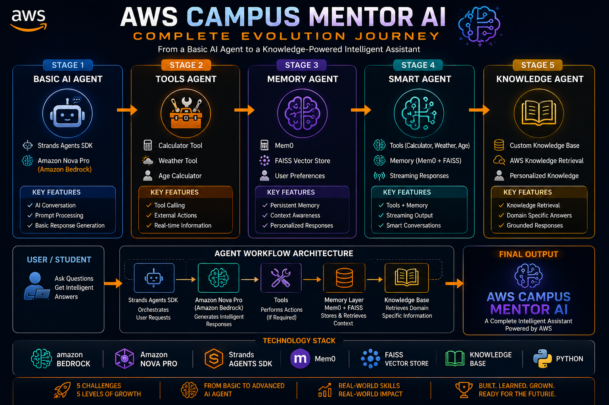

# 🚀 AWS Campus Mentor AI

An end-to-end Generative AI learning project built through the AWS Builders Skill Sprint Challenges.

This repository documents the complete evolution of an AI Agent system — from a simple conversational agent to a knowledge-powered intelligent assistant using Amazon Bedrock, Amazon Nova Pro, Strands Agents SDK, Memory Systems, Tool Calling, Streaming Responses, and Knowledge Retrieval.

---

## 🎯 Project Journey

This project was built incrementally through five challenges.

### ✅ Challenge 1 – AI Agent

Built a basic AI assistant using Strands Agents SDK.

**Features**
- AI Conversation
- Amazon Nova Pro
- Bedrock Integration
- Prompt Engineering

---

### ✅ Challenge 2 – Tools Agent

Enhanced the AI agent with external tools.

**Tools Added**
- Calculator
- Weather Tool
- Age Calculator

---

### ✅ Challenge 3 – Memory Agent

Added persistent memory capabilities.

**Features**
- Mem0 Integration
- User Preference Storage
- Personalized Responses
- Context Awareness

---

### ✅ Challenge 4 – Smart Agent

Combined tools, memory, and streaming responses.

**Features**
- Calculator
- Weather
- Age Calculator
- Memory
- Streaming Responses

---

### ✅ Challenge 5 – Knowledge Agent

Built a knowledge-powered AI assistant.

**Features**
- Custom Knowledge Base
- AWS Knowledge Retrieval
- Campus Information Retrieval
- Knowledge-Grounded Responses

---

## 🛠 Technologies Used

- Amazon Bedrock
- Amazon Nova Pro
- Strands Agents SDK
- Python
- Mem0
- FAISS
- Tool Calling
- Knowledge Retrieval
- Streaming Responses

---

## 📂 Repository Structure

aws-campus-mentor-ai/

├── Challenge-1/

├── Challenge-2/

├── Challenge-3/

├── Challenge-4/

├── Challenge-5/

├── screenshots/

├── README.md

└── .gitignore

---

## 🎓 Key Learnings

- AI Agent Development
- Tool Calling
- Memory Systems
- Knowledge Retrieval
- Amazon Bedrock
- Amazon Nova Pro
- Strands Agents SDK
- Generative AI Engineering

---

## 🚀 Future Roadmap

- MCP Integration
- AWS Documentation Search
- RAG Pipelines
- OpenSearch Integration
- Multi-Agent Systems
- Enterprise AI Assistants

---

---

## 🏗️ Complete Evolution Architecture

---

## 🏆 Achievement

Successfully completed all AWS Builders Skill Sprint Challenges and transformed a simple AI agent into a complete Knowledge-Powered AI Assistant.

Built with ❤️ using Amazon Bedrock, Amazon Nova Pro and Strands Agents SDK.